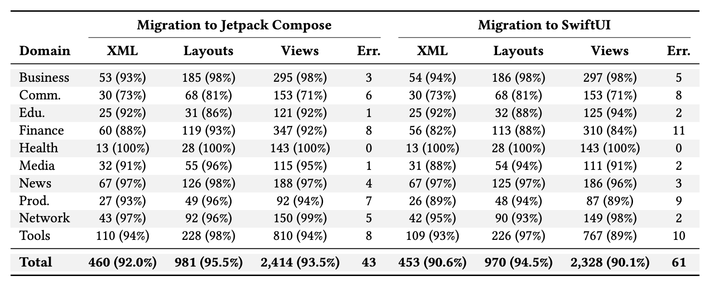

#  GUIMigrator: Semantics-Preserving Transpilation from
Android XML to Compose and SwiftUI

## 📑 Table of Contents
- [Description](#Description)
- [Project Structure](#ProjectStructure)
- [Experiments](#Experiments)
  - [Datasets](#Datasets)
  - [Results](#Results)
- [Usage](#Usage)

## 📝 Description
Constructing user interfaces (UIs) is one of the most resource-intensive tasks in mobile development, often consuming more than half of overall effort. Although declarative frameworks such as **Jetpack Compose** (Android) and **SwiftUI** (iOS) have become mainstream, most Android apps still rely on **legacy XML-based layouts**.

Migrating these UIs to declarative paradigms is essential for **maintainability** and **cross-platform reuse**, but manual migration is costly, error-prone, and difficult to scale.

We present **GUIMigrator**, a semantics-preserving framework that automates the migration of Android XML-based UIs to Jetpack Compose and SwiftUI.

Key features:
- **Semantic UI Transpiler (SUT):** abstracts layout structures and resource semantics from legacy XML.
- **Cross-platform consistency:** systematically re-expresses semantics using idioms of Compose and SwiftUI.
- **Deterministic yet extensible design:** separates semantic interpretation from platform realization, avoiding unpredictability of purely generative approaches.

Evaluation on **31 open-source apps across ten domains** shows:
- High migration completeness and **visual similarity** (Compose: 82%, SwiftUI: 78%).
- Outperforms GPT-4 baseline in **structural fidelity**.
- Reduces manual development effort by **>90%**.

These results demonstrate that GUIMigrator is a **practical and effective solution** for reusing Android UIs across modern declarative frameworks.

---

## 📖 ProjectStructure

```
GUIMigrator
├── datasets  - Experimental data.
│   ├── business - Result data, including target UI files generated by the tool (.swiftui), etc.
│   └── communication 
│   └── ... 
│   └── tools
├── src  - Project source code.
│   ├── entity -  Includes project source code structure, etc.
│   ├── utils - Common utilities for logging, file operations, etc.
│   └── service
│       ├── parser - Parser for Android UI elements (layouts, views,).
│       ├── rule - UI transpilation rules.
│       └── transpiler - Includes logic for Android source code analysis, transpilation, etc.
├── test  - Project test files.
└── resources - Project configuration files, including scanned client Android apps,  etc.
```
**Pipeline**   


## 🧪 Experiments

- **RQ1: Migration Quality**  
  To what extent does GUIMigrator preserve the **visual fidelity** and **structural semantics** of the original UI?

- **RQ2: Migration Effectiveness**  
  How many **UI elements and attributes** can GUIMigrator successfully migrate across diverse applications?

- **RQ3: Development Effort Reduction**  
  How much **manual engineering effort** can be saved compared to rebuilding UIs from scratch?

- **RQ4: Migration Performance**  
  What is the **runtime overhead** of the migration process in terms of efficiency and scalability?


### 📊 Datasets

Complete dataset：please refer to `datasets` directory.  
The sources of Android applications (Github 9.9k &#9733;):
[open-source-android-apps](https://github.com/pcqpcq/open-source-android-apps)
Here you can find all the source code files for the projects mentioned in the paper.

| App Name                 | Source Code Link                                                 |
|--------------------------|------------------------------------------------------------------|
| Android-Ganhuo           | https://github.com/ganhuo/Android-Ganhuo                         |
| AndroidRivers            | https://github.com/dodyg/AndroidRivers                           |
| Awkward Ratings          | https://github.com/nasahapps/AwkwardRatings-Android              |
| Carbon                   | https://github.com/abhijith0505/CarbonContacts                   |
| ChatSecureAndroid        | https://github.com/guardianproject/ChatSecureAndroid             |
| Clean Status Bar         | https://github.com/emmaguy/clean-status-bar                      |
| Coins                    | https://github.com/soffes/coins-android                          |
| Cotable                  | https://github.com/wlemuel/Cotable                               |
| EverMemo                 | https://github.com/daimajia/EverMemo                             |
| GnuCash                  | https://github.com/codinguser/gnucash-android                    |
| GivesMeHope              | https://github.com/jparkie/GivesMeHopeAndroidClient              |
| Hackathon                | https://github.com/Neophytes/microsoft-pragyan-hackathon         |
| Habitica                 | https://github.com/HabitRPG/habitica-android                     |
| Heart-Rate               | https://github.com/phishman3579/android-heart-rate-monitor       |
| Hex                      | https://github.com/longdivision/hex                              |
| Hacker-News              | https://github.com/manmal/hn-android                             |
| HttpSMS                  | https://github.com/NdoleStudio/httpsms                           |
| KissProxy                | https://github.com/dawsonice/KissProxy                           |
| Medical-Data             | https://github.com/Ana06/medical-data-android                    |
| OpenShop                 | https://github.com/openshopio/openshop.io-android                |
| Say-Hi                   | https://github.com/amritsinghcse/Say-Hi                          |
| SmartTube                | https://github.com/yuliskov/SmartTube                            |
| Vineyard                 | https://github.com/hitherejoe/Vineyard                           |
| ContentProviderHelper    | https://github.com/k3b/ContentProviderHelper/                    |
| Bitocle                  | https://github.com/mthli/Bitocle                                 |
| BetterBatteryStats       | https://github.com/asksven/BetterBatteryStats                    |
| AIMSICD                  | https://github.com/CellularPrivacy/Android-IMSI-Catcher-Detector |
| CNode                    | https://github.com/iwhys/CNode-android/                          |
| SoundRecorder            | https://github.com/dkim0419/SoundRecorder                        |

### 📈 Result
- **Visual similarity:** Compose 82%, SwiftUI 78%
- **Structural fidelity:** Higher than GPT-4 baseline
- **Effort reduction:** >90% less manual work
- **Performance:** Migration completes in seconds per layout

#### 🔹 Migration Outcomes
Results of UI migration across ten domains. Metrics include the number and proportion of successfully
migrated XML files (XML), layouts (Layouts), and views (Views), together with the number of syntax errors
in the generated code (Errors).



#### 🔹 Comparative Effectiveness

Comparative results of UI migration effectiveness. We report Code Relative Change (CRC), Code
Token Change (CTC), and Structural Similarity Index (SSIM). Baseline uses GPT-4, compared with GUIMigrator.


## 💻 Usage
---
### 🔹 Step 1: Task Parameter Configuration

Supplement parameter configurations in the `task.properties` file, including Android app file paths.

You need to locate the `task.properties` file in the `src/main/resources` directory, and then set the resourcePath to
the full path of the `res` directory of the Android app you wish to migrate.

The tool will automatically parse and migrate UI resources, layouts, and views from the `res` directory.

### 🔹Step 2: Transpile Android UI

Execute the Main class:

Navigate to the main directory:
```
cd src/main/java
```
Open `Main.java` in your IDE.

Run the `Main` class.

This will transpile Android XML-based UI elements into Jetpack Compose and SwiftUI code.

this process will transpile Android UI elements.

📌 Tips
> Ensure the task.properties file is configured correctly before running.      
> The transpiled files will be stored under the output directory specified in the configuration.         
> Check the logs for warnings (e.g., unmapped UI attributes).        