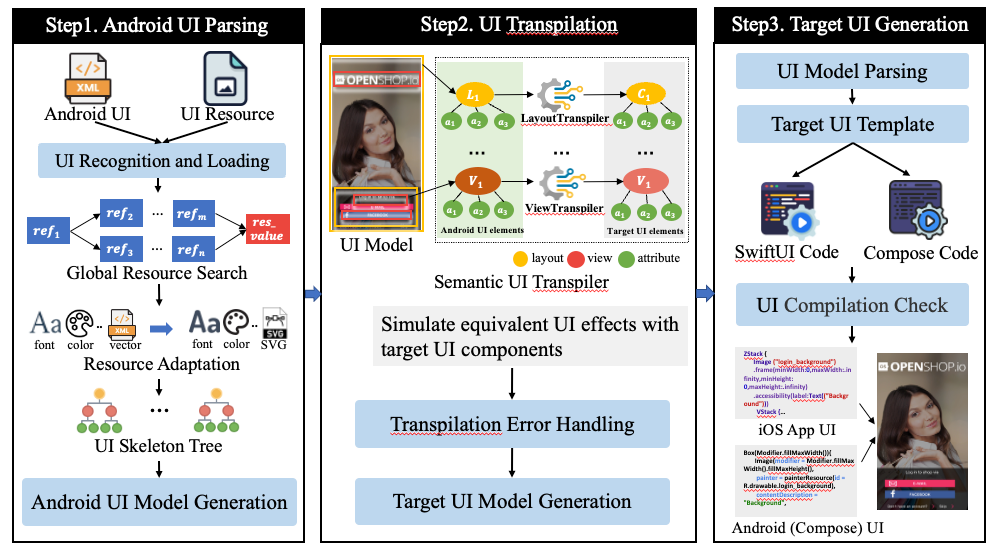

# GUIMigrator

- [Description](#Description)
- [Project Structure](#ProjectStructure)
- [Datasets](#Datasets)
- [Usage](#Usage)

## Description

> In mobile development, constructing user interfaces (UIs) remains a resource-intensive task.
Declarative frameworks such as Jetpack Compose (Android) and SwiftUI (iOS) have become mainstream due to their superior support for UI development.
However, as legacy Android apps predominantly rely on XML-based layouts, migrating them to modern declarative paradigms remains manual, time-consuming, and error-prone.
> 
> To address the challenges of migrating legacy XML-based UIs to modern declarative frameworks, we propose a novel approach called GUIMigrator, which enables the cross-platform migration of Android app UIs to both iOS (SwiftUI) and modern Android (Jetpack Compose).
GUIMigrator first extracts and parses Android UI layouts, views, and resources to construct a UI skeleton tree.
To facilitate the migration process, we design a specialized UI migration transpiler called Semantic UI Transpiler (SUT), which simulates the semantics of Android UIs and generates corresponding declarative representations in SwiftUI and Jetpack Compose, ensuring consistency across platforms.
Finally, GUIMigrator produces the final UI code files using target-specific templates, which are compiled and validated on their respective platforms, such as Xcode for iOS and Android Studio for Compose.
We evaluate the effectiveness of GUIMigrator on 31 Android open-source applications across ten domains.
The results show that GUIMigrator achieves a UI similarity score of 78\% between pre- and post-migration screenshots, significantly outperforming a widely used LLM-based baseline.
In addition, GUIMigrator reduces development effort, with a 98\% reduction in manual code changes and a 90\% decrease in development time compared to building UIs from scratch.
These findings indicate that GUIMigrator effectively facilitates the migration and reuse of Android UIs across platforms, leveraging the strengths of both platforms’ UI frameworks and making new contributions to automated cross-platform UI development.

## ProjectStructure

```
GUIMigrator
├── datasets  - Experimental data.
│   ├── business - Result data, including target UI files generated by the tool (.swiftui), etc.
│   └── communication 
│   └── ... 
│   └── tools
├── src  - Project source code.
│   ├── entity -  Includes project source code structure, etc.
│   ├── utils - Common utilities for logging, file operations, etc.
│   └── service
│       ├── parser - Parser for Android UI elements (layouts, views,).
│       ├── rule - UI transpilation rules.
│       └── transpiler - Includes logic for Android source code analysis, transpilation, etc.
├── test  - Project test files.
└── resources - Project configuration files, including scanned client Android apps,  etc.
```
# Pipeline



## Datasets

Complete dataset：please refer to `datasets` directory.  
The sources of Android applications (Github 9.9k &#9733;):
[open-source-android-apps](https://github.com/pcqpcq/open-source-android-apps)
Here you can find all the source code files for the projects mentioned in the paper.

| App Name                 | Source Code Link                                                 |
|--------------------------|------------------------------------------------------------------|
| Android-Ganhuo           | https://github.com/ganhuo/Android-Ganhuo                         |
| AndroidRivers            | https://github.com/dodyg/AndroidRivers                           |
| Awkward Ratings          | https://github.com/nasahapps/AwkwardRatings-Android              |
| Carbon                   | https://github.com/abhijith0505/CarbonContacts                   |
| ChatSecureAndroid        | https://github.com/guardianproject/ChatSecureAndroid             |
| Clean Status Bar         | https://github.com/emmaguy/clean-status-bar                      |
| Coins                    | https://github.com/soffes/coins-android                          |
| Cotable                  | https://github.com/wlemuel/Cotable                               |
| EverMemo                 | https://github.com/daimajia/EverMemo                             |
| GnuCash                  | https://github.com/codinguser/gnucash-android                    |
| GivesMeHope              | https://github.com/jparkie/GivesMeHopeAndroidClient              |
| Hackathon                | https://github.com/Neophytes/microsoft-pragyan-hackathon         |
| Habitica                 | https://github.com/HabitRPG/habitica-android                     |
| Heart-Rate               | https://github.com/phishman3579/android-heart-rate-monitor       |
| Hex                      | https://github.com/longdivision/hex                              |
| Hacker-News              | https://github.com/manmal/hn-android                             |
| HttpSMS                  | https://github.com/NdoleStudio/httpsms                           |
| KissProxy                | https://github.com/dawsonice/KissProxy                           |
| Medical-Data             | https://github.com/Ana06/medical-data-android                    |
| OpenShop                 | https://github.com/openshopio/openshop.io-android                |
| Say-Hi                   | https://github.com/amritsinghcse/Say-Hi                          |
| SmartTube                | https://github.com/yuliskov/SmartTube                            |
| Vineyard                 | https://github.com/hitherejoe/Vineyard                           |
| ContentProviderHelper    | https://github.com/k3b/ContentProviderHelper/                    |
| Bitocle                  | https://github.com/mthli/Bitocle                                 |
| BetterBatteryStats       | https://github.com/asksven/BetterBatteryStats                    |
| AIMSICD                  | https://github.com/CellularPrivacy/Android-IMSI-Catcher-Detector |
| CNode                    | https://github.com/iwhys/CNode-android/                          |
| SoundRecorder            | https://github.com/dkim0419/SoundRecorder                        |

## Usage

### Step 1: Task Parameter Configuration

Supplement parameter configurations in the `task.properties` file, including Android app file paths.

You need to locate the `task.properties` file in the `src/main/resources` directory, and then set the resourcePath to
the full path of the `res` directory of the Android app you wish to migrate.

The tool will automatically parse and migrate UI resources, layouts, and views from the `res` directory.

### Step 2: Transpile Android UI

Execute the `Main` class.

- 2.1 First, navigate to the main directory: `src/main/java`.
- 2.2 Open `Main.java` in any IDE, and then run the main class.

this process will transpile Android UI elements.

## Results

<div style="border-left: 5px solid #FF9900; padding: 10px; background-color: #cbf1cc;">
:) To preview the UI files generated from the migration, you will need to import the generated SwiftUI files into Xcode.
</div>
